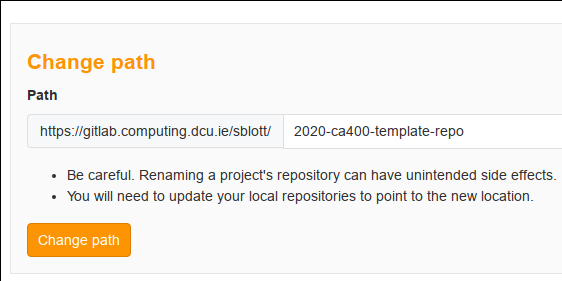

# CA400 template repo

This is a template for CA400 projects.

## 1. Create your repo

One person from your project team should fork this repo, then add other teammates as project members on GitLab.

## 2. Name your repo appropriately

The name of your project must be of the form `2020-ca400-XXXXXXX`, where "`XXXXXXX`"
should be replaced with your usernames (e.g. `2020-ca400-sblott-pclark`).

It is the *name of your repo* which matters (not the name of your project).

You can change the name of your repo on GitLab under:

- Settings / General / Advanced / Change path

It looks like this:

You should replace all of this file with a README describing your own project.

## Additional resources

- Repo [hygiene](https://gitlab.computing.dcu.ie/sblott/local-gitlab-documentation/blob/master/repo-hygiene.md)
- Git [cheat sheet](https://gitlab.computing.dcu.ie/sblott/local-gitlab-documentation/blob/master/cheat-sheet.md)
- Gitlab [CI environment](https://gitlab.computing.dcu.ie/sblott/docker-ci-environment) and it's [available software](https://gitlab.computing.dcu.ie/sblott/docker-ci-environment/blob/master/Dockerfile)
- Example projects with CI configured:
   * [Python](https://gitlab.computing.dcu.ie/sblott/test-project-python)
   * [Java](https://gitlab.computing.dcu.ie/sblott/test-project-java)
   * [MySql](https://gitlab.computing.dcu.ie/sblott/test-project-mysql)
